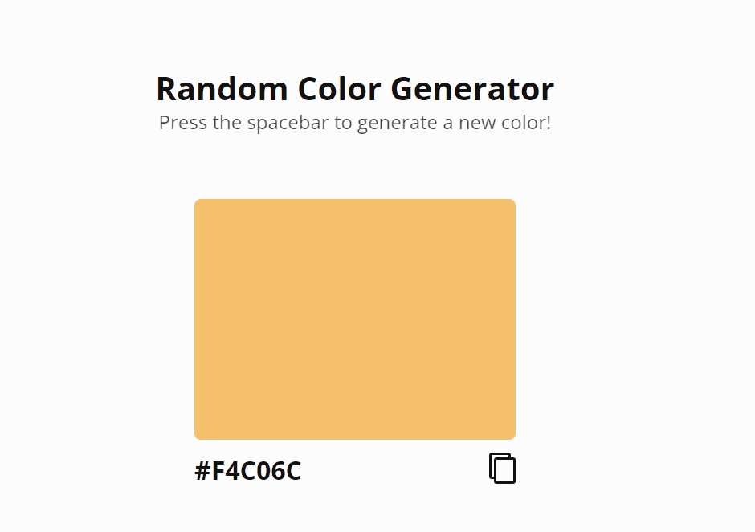

<h4 align="center">
  Plataforma de geração de cores randômicas.
</h4>

<p align="center">
 <a href="#four_leaf_clover-tecnologias-utilizadas">Tecnologias utilizadas</a> •
 <a href="#rocket-subindo-a-aplicação">Subindo a aplicação</a>
</p>

<h2 align="center">
  
</h2>

## :four_leaf_clover: Tecnologias utilizadas

Esse projeto está sendo desenvolvido com as seguintes tecnologias.

-   [ReactJS](https://reactjs.org/)
-   [Babel](https://babeljs.io/)
-   [Typescript](https://www.typescriptlang.org/)
-   [Webpack](https://webpack.js.org/)
-   [Node-sass](https://github.com/sass/node-sass)
-   [VS Code][vc]

## :rocket: Subindo a aplicação

Para clonar e subir a aplicação, é necessário ter o [Git](https://git-scm.com) e
o [Node.js][nodejs] instalados em sua máquina.

```bash
# Faça um clone da aplicação.
$ git clone https://github.com/yurimutti/random-colors.git

# Vá até o repositório.
$ cd random-colors

# Instale as dependências.
$ yarn

# Ou
$ npm install

# Suba a aplicação.
$ yarn dev

# Ou
$ npm run dev

```

---

[Yuri Mutti no LinkedIn](https://www.linkedin.com/in/yuri-mutti-0418bb1aa/)

[nodejs]: https://nodejs.org/
[npm]: https://www.npmjs.com/
[vc]: https://code.visualstudio.com/
